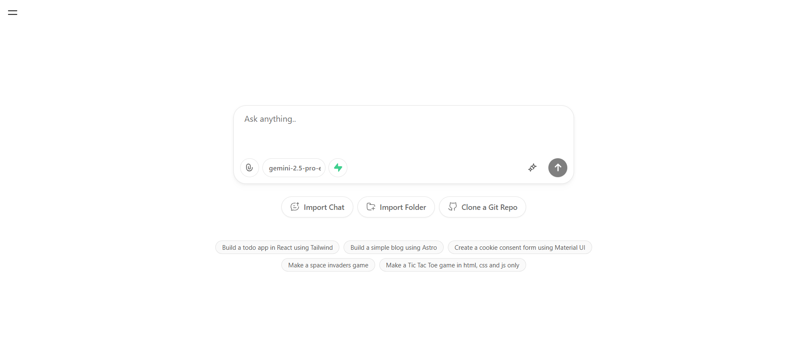
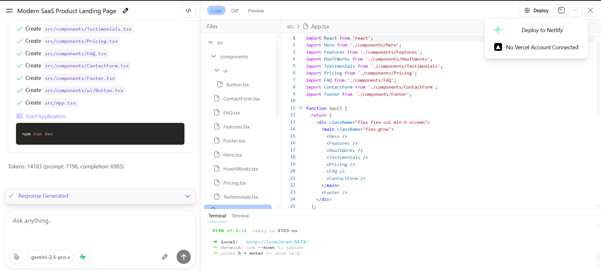
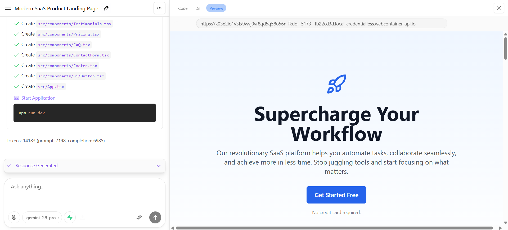

# ✨ WebAI: Turn Ideas into Websites Instantly ✨

[](https://www.typescriptlang.org/)
[](https://sdk.vercel.ai/)
[](https://stackblitz.com/docs/platform/webcontainers)
[](https://supabase.com/)
[](https://www.netlify.com/)
[](https://vercel.com/)
<!-- Optional: Add more badges like build status, license, etc. -->
<!-- [](https://github.com/sujiiiiit/webai/actions) -->
<!-- [](https://opensource.org/licenses/MIT) -->

---

🚀 **Transform your web interface concepts – whether images or text descriptions – into functional, optimized frontend code with the power of AI.** 🚀

WebAI is an innovative platform designed to bridge the gap between design inspiration and tangible code. It automates the often tedious process of translating visual mockups or textual ideas into efficient, cross-compatible frontend components and layouts, empowering creators of all skill levels.

---

## 📖 Table of Contents

*   [What is WebAI?](#-what-is-webai)
*   [Why WebAI?](#-why-webai)
*   [Key Features](#-key-features)
*   [How Does It Work?](#-how-does-it-work-detailed)
*   [Use Cases](#-use-cases)
*   [Technologies Used](#-technologies-used)
*   [Screenshots / Demo](#-screenshots--demo)
*   [Getting Started (Development)](#-getting-started-development)
*   [Team & My Contribution](#-team--my-contribution)
*   [Future Work / Roadmap](#-future-work--roadmap)
*   [License](#-license) *(Optional)*

---

## 🎨 What is WebAI?

Imagine sketching a website layout on a piece of paper, taking a photo, or simply describing the website you envision in plain English. Now, imagine feeding that into a tool that automatically generates the underlying HTML, CSS, and JavaScript/TypeScript code for you. That's the magic of WebAI!

This project harnesses the capabilities of advanced AI models, specifically Large Language Models (LLMs) and potentially Vision Models, to interpret your creative input. It doesn't just spit out code; it aims to generate structured, readable, and efficient frontend code, often utilizing popular frameworks, while providing an entire ecosystem for refinement and deployment.

## 🤔 Why WebAI?

*   **Speed Up Development:** Drastically reduce the time from concept to functional prototype.
*   **Bridge Design & Code:** Make it easier for designers to see their visions implemented and for developers to start with a solid foundation.
*   **Lower Barrier to Entry:** Enable individuals with great ideas but limited coding experience to build web interfaces.
*   **Promote Experimentation:** Quickly test different layouts and component ideas without extensive manual coding.
*   **Streamline Workflow:** Offers an end-to-end solution from generation to live deployment.

## 🌟 Key Features

*   **🤖 AI-Powered Code Generation:** Leverages the Vercel AI SDK for flexible integration with various state-of-the-art LLMs, translating ideas into clean code.
*   **🖼️ Image-to-Code Conversion:** Upload UI mockups, wireframes, or even hand-drawn sketches, and let the AI generate corresponding code structures.
*   **✍️ Text-to-Code Generation:** Describe web components, layouts, or entire pages using natural language prompts.
*   **💻 Integrated Development Environment (IDE):** Features a built-in code editor and terminal for real-time code inspection and modification.
*   **⚡ Instant Live Previews:** Powered by the innovative StackBlitz WebContainer API, see your generated website render and function live in a browser sandbox – no local setup needed!
*   **🔗 One-Click Database Integration:** Seamlessly provision and connect a Supabase backend database to your generated frontend with a single click.
*   **☁️ Effortless Deployment:** Deploy your creation to the world via Netlify or Vercel directly from the WebAI interface.
*   **📱 Responsive & Functional Components:** Focuses on generating UI code that is adaptable to various screen sizes and includes interactive elements.
*   **🧩 Modular Generation:** Aims to generate code in a component-based manner, promoting reusability and maintainability. *(Confirm if this is accurate)*
*   **🛠️ Code Optimization:** The generated code aims for efficiency and compatibility. *(Confirm optimization goals)*

## ⚙️ How Does It Work? (Detailed)

1.  **Input:** The user provides input through a user-friendly interface – either uploading an image file (e.g., PNG, JPG) or typing a descriptive text prompt.
2.  **Preprocessing (Optional):** Images might undergo preprocessing (e.g., object detection, layout analysis) to extract key visual elements. Text prompts are parsed to identify requirements.
3.  **AI Core Interaction:**
    *   **For Images:** A vision-capable AI model analyzes the image to understand the structure, components (buttons, inputs, text blocks), layout, and styling (colors, fonts).
    *   **For Text:** A Large Language Model (LLM) interprets the natural language description to grasp the desired functionality and appearance.
    *   The Vercel AI SDK facilitates communication with these models, potentially chaining prompts or selecting appropriate models for sub-tasks.
4.  **Code Generation:** Based on the AI's understanding, the system generates code, typically HTML for structure, CSS/SCSS for styling, and JavaScript/TypeScript for interactivity, potentially targeting a specific framework like React, Vue, or Angular.
5.  **Bundling & Preview:** The generated code files are bundled and loaded into a StackBlitz WebContainer instance via their API. This creates a secure, isolated browser environment.
6.  **Live Rendering:** The WebContainer renders the website, allowing the user to interact with it immediately within the WebAI platform.
7.  **Iteration & Enhancement:** The user can review the generated code in the integrated editor, make modifications, utilize the integrated terminal, connect a Supabase database, or trigger deployment.
8.  **Deployment:** Upon user request, WebAI interacts with Netlify or Vercel APIs to deploy the generated (and potentially modified) code to a live URL.

## 🎯 Use Cases

*   **Rapid Prototyping:** Quickly build interactive prototypes from designs or ideas for user testing or stakeholder feedback.
*   **Design Handoff:** Provide developers with a functional starting point based on design mockups.
*   **Learning & Education:** Help aspiring developers understand how visual designs translate into code.
*   **Component Generation:** Quickly scaffold individual UI components based on descriptions or examples.
*   **Marketing Landing Pages:** Generate simple landing pages or marketing sites from textual descriptions.
*   **Internal Tools:** Speed up the creation of basic internal dashboards or interfaces.

## 🛠️ Technologies Used

*   **Core Language:** TypeScript
*   **Styling:** SCSS
*   **AI Integration:** Vercel AI SDK (`@ai-sdk/core`, `@ai-sdk/provider-specific-libs`)
*   **Live Previews/IDE:** StackBlitz WebContainer API
*   **Database:** Supabase (Client Libraries, Management API)
*   **Deployment:** Netlify API, Vercel API
*   **Frontend Framework (Generated Code):** *remix, typescript, unocss*
*   **UI Components (WebAI Platform):** *shadcn-ui, unocss, tailwindcss*
*   **Backend (if any for WebAI itself):** *(Specify Node.js, Python, etc., if applicable)*
*   **Package Manager:** *pnpm*

## 🖼️ Screenshots / Demo

*(This section is crucial! Replace placeholders with actual visuals.)*

**1. Input Interface (Image & Text Options):**


**2. Code Generation & Editor View:**


**3. Live Preview Pane (StackBlitz Integration):**


---

## 🚀 Getting Started (Development)

Want to run WebAI locally ? Follow these steps:

1.  **Clone the repository:**
    ```bash
    git clone https://github.com/sujiiiiit/webai.git
    cd webai
    ```

2.  **Install dependencies:**
    ```bash
    pnpm install
    ```

3.  **Environment Variables:**
    *   You'll likely need API keys for Vercel AI SDK, Supabase, Netlify, and Vercel.
    *   Create a `.env.local` file in the root directory.
    *   Copy the contents of `.env.example` into `.env.local` and fill in your keys.
    ```plaintext name=.env.local
    # Example - Replace with actual variables needed
    OPENAI_API_KEY=your_openai_key
    SUPABASE_URL=your_supabase_project_url
    SUPABASE_ANON_KEY=your_supabase_anon_key
    NETLIFY_AUTH_TOKEN=your_netlify_token
    VERCEL_API_TOKEN=your_vercel_token
    # Add other necessary variables
    ```

4.  **Run the development server:**
    ```bash
    pnpm dev
    ```

5.  Open [http://localhost:3000](http://localhost:3000) (or the specified port) in your browser.

---

## 👥 Team & My Contribution

WebAI was developed by a dedicated team of 4 members. The project's goal was to automate the transformation of web interface images and text prompts into optimized, efficient, and compatible frontend code.

As the **Frontend Developer** (`sujiiiiit`), my key contributions focused on building the user-facing platform and integrating the core technologies:

*   **UI/UX Development:** Built the functional and responsive UI components for the WebAI platform itself, ensuring a smooth and intuitive user experience.
*   **API Integration:** Responsible for integrating and handling API calls to the AI services (via Vercel AI SDK), Supabase, StackBlitz, Netlify, and Vercel, connecting them seamlessly with the frontend interface.
*   **AI SDK Implementation:** Leveraged the `@ai-sdk` to effectively integrate various LLMs and generative models, ensuring modularity and efficiency in AI interactions.
*   **IDE Features:** Implemented the functional development environment features, including the integrated terminal display and interaction logic.
*   **Live Previews:** Engineered the integration with the StackBlitz WebContainer API to manage and display the live previews and outputs of the generated websites.
*   **Database Connectivity:** Integrated Supabase functionality, enabling users to instantly connect their generated websites to a database backend with a single click.
*   **Deployment Automation:** Added the one-click deployment features using Netlify and Vercel APIs, simplifying the process for users to get their websites live.

---

## 🔮 Future Work / Roadmap

While WebAI is powerful, there's always room for growth! Potential future enhancements include:

*   [ ] Support for more frontend frameworks (e.g., Vue, Svelte, Angular).
*   [ ] Enhanced AI models for more accurate image interpretation.
*   [ ] Advanced styling options and theme generation.
*   [ ] Code refactoring and optimization suggestions.
*   [ ] Support for backend code generation (e.g., simple APIs).
*   [ ] Collaborative features for teams.
*   [ ] Improved state management handling in generated code.
*   [ ] Integration with design tools like Figma.

## 📜 License

This project is licensed under the [MIT License](LICENSE).

---

# Happy contributing
